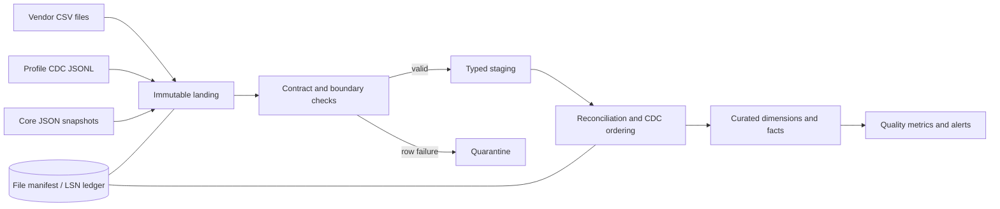

# Part 1 — Pipeline Design and Reconciliation

## Design choice

The pipeline keeps the original files, checks and cleans the data, then publishes trusted
warehouse tables. The production design is not tied to one cloud provider. DuckDB provides
a small local version that reviewers can run without setting up a database server.

Vendor files are trusted for deposits created by that vendor. They do not overwrite the
existing warehouse feed. If two records disagree, the pipeline sets them aside for review
instead of guessing which value is correct.

### Layer responsibilities

| Layer | What happens here | Why it matters |
|---|---|---|
| Landing/raw | Keep each source record unchanged and add file, batch, arrival, and hash metadata. | Nothing is lost; any run can be audited or replayed. |
| Validation | Check columns, types, IDs, and basic financial rules. | Bad data is visible before it reaches reports. |
| Staging | Standardize names and data types, including `method` → `payment_method`. | Downstream logic sees one consistent shape. |
| Reconciliation | Remove exact repeats, flag conflicts, and apply profile changes in LSN order. | Records are neither duplicated nor silently overwritten. |
| Curated | Publish analysis-ready client, deposit, trade, and balance tables. | Analysts query stable business tables instead of raw files. |

## Data contracts

The prototype makes these assumptions explicit because the brief provides no production
SLA or scale:

| Boundary | Contract | SLA/SLO assumption | Failure action |
|---|---|---|---|
| Vendor file → landing | CSV has the expected ten semantic fields; approved alias `method` maps to `payment_method`; UTF-8; `deposit_id` and `client_id` required. | Daily file expected by 06:00 UTC; freshness alert after 26 hours; 100% files recorded in manifest. | Unknown/missing required column: fail file and alert. Approved alias: warn and normalize. |
| Vendor row → staging | Valid ISO date, numeric financial fields, nonblank IDs, recognized status/method. | At least 99% valid rows; 100% row accounting between staged and quarantined. | Invalid business row: quarantine row and continue batch; negative deposits are quarantined as critical. |
| CDC → staging | Unique integer LSN, supported `insert/update/delete`, valid client ID, `after` present except delete and `before` present except insert. | No duplicate conflicting LSN; LSN gap unresolved for 15 minutes alerts in production. | Conflicting duplicate LSN or malformed operation: fail CDC batch. Exact replay: skip idempotently. |
| Staging → curated | Parent client exists or an inferred member is created; keys and effective intervals remain unique/non-overlapping. | 100% referential accounting and zero overlapping SCD intervals. | Invariant violation: roll back curated transaction and alert. |

Freshness is measured from arrival metadata, not `deposit_date`; completeness reconciles
landing row counts to staged plus quarantined rows. Basic lineage is persisted as
`source_file → batch_id → target_table/key`.

## Safe reruns (idempotency)

Running the same input twice must produce the same result. Four controls enforce this:

1. **File manifest:** `ingestion_file_manifest` has a unique SHA-256 `file_hash`, source,
   name, status, row counts, and batch timestamps. An identical successful file is skipped;
   the same name with different content is processed as a new version and alerts.
2. **Business key and row hash:** vendor staging is deduplicated on `deposit_id`. Identical
   repeats such as `VDEP002` and `VDEP005` are counted as duplicates; conflicting repeats
   are quarantined. Canonical writes use `MERGE` keyed by `(source_system, deposit_id)`.
3. **CDC ledger:** raw CDC is append-only with unique LSN and payload hash. Events are
   applied in ascending LSN order and recorded in `cdc_processing_ledger`; a successfully
   applied LSN is never applied twice.
4. **Atomic publication:** manifest/ledger updates and curated mutations occur in one
   DuckDB transaction. A failed batch remains retryable and never appears successful.

## Matching the vendor feed to the warehouse

The two sources use different ID ranges (`DEP…` and `VDEP…`), so a deposit is identified by
both its source and its ID: `(source_system, deposit_id)`. Vendor rows are classified as:

- `new`: unseen vendor key; load after validation.
- `duplicate_identical`: same key and canonical row hash; retain one record and a duplicate
  metric.
- `duplicate_conflict`: same key but different financial/business fields; quarantine both
  versions for review and do not silently choose a winner.
- `orphan_client`: valid deposit but missing client; retain in staging/quarantine and retry
  after client ingestion rather than losing it.

Cross-source business matching may be reported using client, business date, amount, currency,
and method, but it does not collapse records automatically: no source transaction identifier
links a `VDEP…` row to a `DEP…` row. Exact financial comparisons use decimals; a USD amount
tolerance of `$0.01` is explicit and configurable.

## Late and missing data

The scheduler discovers files by manifest state rather than assuming the current filename.
Each run scans an overlap window of the preceding seven delivery days plus any unresolved
expected dates. This picks up `deposits_vendor_20240303.csv` even though its business dates
are in February. A missing expected delivery raises a freshness alert but does not fabricate
an empty successful batch. When the file arrives, its unseen hash is processed automatically;
business-date partitions affected by its rows are merged, not replaced blindly.

## Applying client changes and deletes

Arrival order is preserved as raw audit metadata but is not used to derive target state.
Unapplied events are sorted by LSN because LSN records the true source transaction order.

When risk or account status changes, the previous version gets an end time and a new version
starts. Real balance changes go into the balance-history fact. A delete closes the active
client version and records `is_deleted` and `deleted_at`; it never removes past client,
deposit, trade, or balance records. The unchanged raw CDC table remains the audit trail.

## Explicit edge cases

| Supplied edge case | Handling |
|---|---|
| `method` replaces `payment_method` on 2024-03-02 | Approved schema alias; normalize with warning. Any other unknown drift fails the file. |
| `VDEP002` and `VDEP005` repeat across files | Deduplicate by vendor business key and hash; record duplicate metrics without reloading. |
| 2024-03-03 delivery contains February business dates | Use arrival-aware manifest discovery and merge affected business dates; never infer arrival from `deposit_date`. |
| `VDEP001` has a negative amount | Quarantine as a critical financial-domain failure; do not load to the deposit fact. |
| `VDEP020` references `CL099` | Quarantine as an orphan and retry after client loads; report referential-completeness failure. |

Additional source anomalies, including `DEP020 → CL031`, the misspelled `credit_card` field
in `DEP012`, and out-of-order CDC LSNs, are retained in the validation report rather than
silently repaired.

## Observability and recovery

Each run emits file freshness, landed/staged/quarantined/loaded counts, duplicate counts,
orphan counts, reconciliation outcomes, latest applied LSN, LSN gaps, and SCD-overlap checks.
Warnings permit publication only for approved drift or exact duplicates; critical contract,
financial, CDC-order, and history-invariant failures either quarantine the row or roll back
the batch as specified above. Reprocessing starts from the immutable landing data and
manifest/ledger state, making recovery deterministic.
