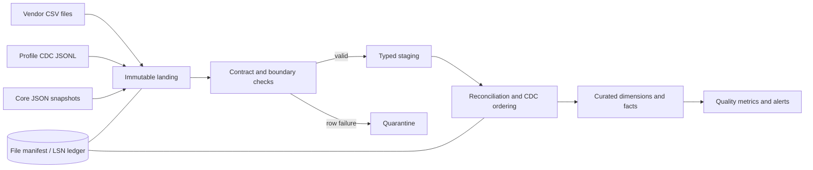

# Part 1 — Pipeline Design and Reconciliation

## Design choice

The production design uses a layered, platform-neutral batch architecture; DuckDB is the
local executable reference. This keeps the submission runnable without pretending that an
embedded database is the production scheduler or object store. Vendor files are
authoritative for vendor-origin deposits, while existing warehouse deposits remain intact;
conflicts are surfaced rather than silently overwritten.

### Layer responsibilities

| Layer | Responsibility | Evidence retained |
|---|---|---|
| Landing/raw | Store source payload unchanged; attach `file_name`, `file_hash`, `arrived_at`, `arrival_sequence`, `batch_id`, and row number. | Replayable input and audit trail preserving arrival order. |
| Boundary validation | Check file shape, required columns, types, identifiers, and source-level uniqueness before transformation. | Check result, severity, rejected value, and reason. |
| Staging | Normalize `method` to `payment_method`, parse dates/numerics, standardize source metadata, and calculate a canonical row hash. | Typed, source-aligned records without business overwrites. |
| Reconciliation | Deduplicate vendor rows, compare them to canonical deposits, classify outcomes, and apply CDC state changes in LSN order while retaining raw arrival order. | Match status, mismatch detail, manifest/LSN state. |
| Curated | Merge conforming deposits and populate client dimensions, facts, SCD history, and balance history. | Queryable warehouse state. |

## Data contracts

The prototype makes these assumptions explicit because the brief provides no production
SLA or scale:

| Boundary | Contract | SLA/SLO assumption | Failure action |
|---|---|---|---|
| Vendor file → landing | CSV has the expected ten semantic fields; approved alias `method` maps to `payment_method`; UTF-8; `deposit_id` and `client_id` required. | Daily file expected by 06:00 UTC; freshness alert after 26 hours; 100% files recorded in manifest. | Unknown/missing required column: fail file and alert. Approved alias: warn and normalize. |
| Vendor row → staging | Valid ISO date, numeric financial fields, nonblank IDs, recognized status/method. | At least 99% valid rows; 100% row accounting between staged and quarantined. | Invalid business row: quarantine row and continue batch; negative deposits are quarantined as critical. |
| CDC → staging | Unique integer LSN, supported `insert/update/delete`, valid client ID, `after` present except delete and `before` present except insert. | No duplicate conflicting LSN; LSN gap unresolved for 15 minutes alerts in production. | Conflicting duplicate LSN or malformed operation: fail CDC batch. Exact replay: skip idempotently. |
| Staging → curated | Parent client exists or an inferred member is created; keys and effective intervals remain unique/non-overlapping. | 100% referential accounting and zero overlapping SCD intervals. | Invariant violation: roll back curated transaction and alert. |

Freshness is measured from arrival metadata, not `deposit_date`; completeness reconciles
landing row counts to staged plus quarantined rows. Basic lineage is persisted as
`source_file → batch_id → target_table/key`.

## Idempotency

Idempotency is enforced at complementary levels:

1. **File manifest:** `ingestion_file_manifest` has a unique SHA-256 `file_hash`, source,
   name, status, row counts, and batch timestamps. An identical successful file is skipped;
   the same name with different content is processed as a new version and alerts.
2. **Business key and row hash:** vendor staging is deduplicated on `deposit_id`. Identical
   repeats such as `VDEP002` and `VDEP005` are counted as duplicates; conflicting repeats
   are quarantined. Canonical writes use `MERGE` keyed by `(source_system, deposit_id)`.
3. **CDC ledger:** raw CDC is append-only with unique LSN and payload hash. Events are
   applied in ascending LSN order and recorded in `cdc_processing_ledger`; a successfully
   applied LSN is never applied twice.
4. **Atomic publication:** manifest/ledger updates and curated mutations occur in one
   DuckDB transaction. A failed batch remains retryable and never appears successful.

## Vendor reconciliation

Using only `deposit_id` across warehouse and vendor would be unsafe because their namespaces
are visibly different (`DEP…` versus `VDEP…`). The canonical identity is therefore
`(source_system, deposit_id)`. Vendor rows are classified as:

- `new`: unseen vendor key; load after validation.
- `duplicate_identical`: same key and canonical row hash; retain one record and a duplicate
  metric.
- `duplicate_conflict`: same key but different financial/business fields; quarantine both
  versions for review and do not silently choose a winner.
- `orphan_client`: valid deposit but missing client; retain in staging/quarantine and retry
  after client ingestion rather than losing it.

Cross-source business matching may be reported using client, business date, amount, currency,
and method, but it does not collapse records automatically: no source transaction identifier
links a `VDEP…` row to a `DEP…` row. Exact financial comparisons use decimals; a USD amount
tolerance of `$0.01` is explicit and configurable.

## Late and missing data

The scheduler discovers files by manifest state rather than assuming the current filename.
Each run scans an overlap window of the preceding seven delivery days plus any unresolved
expected dates. This picks up `deposits_vendor_20240303.csv` even though its business dates
are in February. A missing expected delivery raises a freshness alert but does not fabricate
an empty successful batch. When the file arrives, its unseen hash is processed automatically;
business-date partitions affected by its rows are merged, not replaced blindly.

## CDC updates and deletes

Arrival order is preserved as raw audit metadata but is not used to derive target state.
Unapplied events are sorted by LSN and processed sequentially because LSN is the source
transaction-log ordering contract.
Risk/status changes set the current SCD2 row's exclusive `valid_to` to `commit_ts` and create
a new version at that timestamp. Every balance change produces one `fact_client_balance_history` event keyed by
LSN. A delete end-dates the current client version and marks it with `is_deleted = true` and
`deleted_at = commit_ts`; historical versions and facts remain. The immutable raw CDC table
is the audit trail, so no redundant copy-only audit table is added.

## Explicit edge cases

| Supplied edge case | Handling |
|---|---|
| `method` replaces `payment_method` on 2024-03-02 | Approved schema alias; normalize with warning. Any other unknown drift fails the file. |
| `VDEP002` and `VDEP005` repeat across files | Deduplicate by vendor business key and hash; record duplicate metrics without reloading. |
| 2024-03-03 delivery contains February business dates | Use arrival-aware manifest discovery and merge affected business dates; never infer arrival from `deposit_date`. |
| `VDEP001` has a negative amount | Quarantine as a critical financial-domain failure; do not load to the deposit fact. |
| `VDEP020` references `CL099` | Quarantine as an orphan and retry after client loads; report referential-completeness failure. |

Additional source anomalies, including `DEP020 → CL031`, the misspelled `credit_card` field
in `DEP012`, and out-of-order CDC LSNs, are retained in the validation report rather than
silently repaired.

## Observability and recovery

Each run emits file freshness, landed/staged/quarantined/loaded counts, duplicate counts,
orphan counts, reconciliation outcomes, latest applied LSN, LSN gaps, and SCD-overlap checks.
Warnings permit publication only for approved drift or exact duplicates; critical contract,
financial, CDC-order, and history-invariant failures either quarantine the row or roll back
the batch as specified above. Reprocessing starts from the immutable landing data and
manifest/ledger state, making recovery deterministic.
