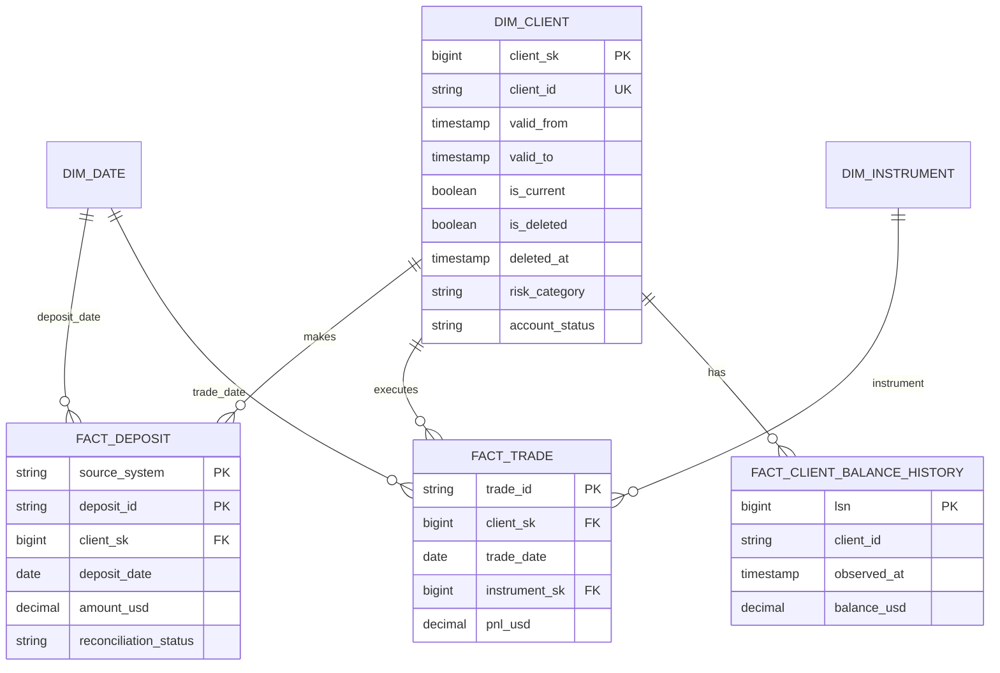

# Part 2 — Data Model and Historization

## Modeling approach

The curated warehouse uses a Kimball star schema: measurable events such as deposits and
trades sit in fact tables, while descriptive information such as client, date, and instrument
sits in dimensions. This matches the questions analysts are likely to ask and keeps joins
simple.

A Data Vault would offer more source-level traceability at very large scale, but would add
several extra table layers here. The raw tables already preserve the original source and
audit trail, so that complexity is not justified for this dataset.

## Dimensional model

### Tables and grain

“Grain” means exactly what one row represents. Stating it prevents accidental double
counting.

| Table | Grain | Key points |
|---|---|---|
| `dim_client` | One version of a client for one effective interval. | Surrogate `client_sk`; natural `client_id`; SCD2 risk/status; signup attributes; masked PII for general analytics. |
| `dim_date` | One calendar date. | Role-played as signup, deposit, and trade date. |
| `dim_instrument` | One normalized trading instrument. | Instrument name/category; avoids repeated descriptive fields. |
| `fact_deposit` | One canonical deposit per `(source_system, deposit_id)`. | Transaction fact; amount/fee/exchange rate; client/date keys; reconciliation status. Partition production data by `deposit_date`; cluster by `client_id`/status where supported. |
| `fact_trade` | One trade per `trade_id`. | Transaction fact; prices, lots, P&L, direction/status; client/date/instrument keys. Partition by `trade_date`; cluster by client/instrument where supported. |
| `fact_client_balance_history` | One actual balance change per CDC LSN and client. | Append-only, keyed by LSN; unchanged `before`/`after` balances are not facts. Supports point-in-time balances without rapidly churning `dim_client`; partition by observed date at scale. |

The local DuckDB prototype is too small to benefit from physical partitioning. The production
choices above follow anticipated time-range and client-level queries and avoid claiming a
performance benefit on thirty-row fixtures.

## When a fact arrives before its client

A deposit or trade is not discarded just because its client record is late. A trusted source
can create a temporary client row containing the client ID and `is_inferred = true`. The row
is completed when the client data arrives. An untrusted or invalid reference such as the
vendor's `CL099` is quarantined instead of creating a potentially false client.

## What history is kept

- `risk_category` and `account_status`: **SCD Type 2**, because compliance and operational
  questions require knowing what classification/status applied at a historical time.
- `account_balance_usd`: **append-only balance-history fact**, not an SCD dimension attribute,
  because balance is a rapidly changing measure and Type 2 would cause dimension churn.
- Stable descriptive fields use Type 1 correction unless a future contract explicitly
  requires their history.

This split keeps meaningful history without creating a new client row for every balance
movement. A point-in-time report combines the client version valid at that moment with the
latest balance change at or before that time.

## How profile changes are applied

Raw events are persisted before transformation, deduplicated by `(lsn, payload_hash)`, then
applied in ascending LSN order inside a transaction:

1. **Insert:** create the initial client version. If the natural key already exists—as with
   the supplied `CL030`—compare the event with known state. An identical/older bootstrap is
   recorded as reconciled; a conflicting insert is quarantined rather than creating two
   current rows.
2. **Update:** reconstruct the new state by applying the partial `after` image to the current
   record. If risk/status changed, end-date the current row at `commit_ts` and insert a new
   current version. If balance changed, append a balance fact keyed by LSN. One CDC event may
   perform both actions atomically.
3. **Delete:** end-date the current version at `commit_ts`, set `is_current = false`,
   `is_deleted = true`, and `deleted_at = commit_ts`. Do not hard-delete dimensions, balance
   history, deposits, or trades.
4. Record the LSN and outcome in `cdc_processing_ledger`. Enforce one current version per
   client and non-overlapping effective intervals.

LSN decides the order; `commit_ts` decides when a change became effective. If an older LSN
arrives late, the affected history is rebuilt from that point rather than appending the event
in the wrong place.

## Reprocessing a historical date range

November 2024 is reprocessed without editing published rows in place:

1. Acquire a logical pipeline lock and select raw CDC events whose effective timestamps
   overlap the range, plus the last client state before the range and the first event after
   it for boundary validation.
2. Rebuild affected client SCD intervals and balance events into shadow tables, ordered by
   LSN. Events outside the range remain untouched.
3. Validate unique LSNs, one current row, no overlapping/gapped intervals caused by the
   rebuild, row accounting, and boundary continuity.
4. In one transaction, delete only affected generated rows by their lineage/batch IDs,
   insert the validated replacements, update the replay ledger, and commit.
5. On failure, roll back the complete transaction; the prior published history remains
   available.

Re-running the same replay produces identical row hashes and keys. The range is expanded to
the earliest affected predecessor when an event changes the state carried into the requested
window; this prevents a nominal “November-only” reload from corrupting downstream history.

## PII and financial access

`email`, `full_name`, and `date_of_birth` are classified as PII; balances, deposits, and
trades are confidential financial data. Raw access is restricted to the ingestion service
and audited Compliance roles. Analytics uses masked client views and surrogate keys; finance
facts use least-privilege role grants, encryption at rest/in transit, and audited access.
